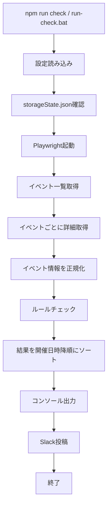

# 猫町OSIROイベント設定チェックCLI 内部設計書

## 1. システム構成

本システムはNode.js + TypeScriptで実装されたCLIアプリケーションである。PlaywrightでOSIRO管理画面を操作し、取得したイベント情報をルールに照合して、結果をSlackへ投稿する。

主要技術:

- Node.js 20以上
- TypeScript
- Playwright
- Slack Web API
- YAML
- Vitest
- Windows Task Scheduler

## 2. ディレクトリ構成

```text
C:\asuka-windows\app\イベントページ自動チェック
├─ config/
│  ├─ rules.yaml
│  └─ rules.example.yaml
├─ docs/
│  ├─ 外部設計書.md
│  └─ 内部設計書.md
├─ scripts/
│  ├─ register-task.ps1
│  └─ run-check.ps1
├─ src/
│  ├─ auth.ts
│  ├─ checker.ts
│  ├─ config.ts
│  ├─ index.ts
│  ├─ list-events.ts
│  ├─ osiro.ts
│  ├─ slack.ts
│  ├─ types.ts
│  └─ utils/
│     ├─ classify.ts
│     ├─ date.ts
│     ├─ normalize.ts
│     ├─ sort.ts
│     ├─ ticket.ts
│     └─ url.ts
├─ tests/
│  └─ utils.test.ts
├─ install-task.ps1
├─ run-check.bat
└─ package.json
```

## 3. モジュール責務

### 3.1 `src/index.ts`

メイン処理を担当する。

処理内容:

1. `.env` とルール設定を読み込む。
2. `storageState.json` の存在を確認する。
3. Playwright Chromiumを起動する。
4. OSIROイベント一覧を取得する。
5. 対象外イベントを除外する。
6. 各イベント詳細を取得する。
7. チェック結果を生成する。
8. 開催日時の降順にソートする。
9. コンソールとSlackへ結果を出力する。

### 3.2 `src/auth.ts`

OSIRO管理画面へのログイン状態を保存する。

Chromiumを表示して手動ログインさせ、ログイン完了後に `storageState.json` を作成する。

### 3.3 `src/list-events.ts`

イベント一覧取得の確認用CLIである。イベント名、種別、詳細URLを出力する。

### 3.4 `src/config.ts`

設定読み込みを担当する。

- `.env` の読み込み
- `config/rules.yaml` の読み込み
- ルール設定の簡易バリデーション
- 定数定義

主要定数:

```ts
EVENT_LIST_URL = "https://nekomachi-club.com/admin/events?state=yet_end"
EVENT_LIST_URLS = [
  EVENT_LIST_URL,
  "https://nekomachi-club.com/admin/events?limit=30&page=2&state=yet_end"
]
STORAGE_STATE_PATH = "storageState.json"
```

### 3.5 `src/osiro.ts`

OSIRO管理画面から情報を取得する。

主な関数:

- `collectEventList`
- `collectEventListWithPagination`
- `fetchEventInfo`
- `collectCurrentPageEvents`

イベント詳細画面では、フォーム内の `input`、`textarea`、`select` をDOM順に走査し、`event_ticket_name` を起点にチケット単位の入力群を構築する。

### 3.6 `src/checker.ts`

イベント設定の検証ロジックを担当する。

主な関数:

- `checkEventInfo`
- `validateTicket`
- `validateOnlineFields`
- `validatePlanChangeTicket`
- `validateFixedFeeTicket`
- `validateOfflineParticipationTypes`
- `validateLegacyMemberDuplicates`

### 3.7 `src/slack.ts`

チェック結果の文字列化とSlack投稿を担当する。

主な関数:

- `postSummaryToSlack`
- `buildSlackMessages`
- `printSummary`

Slackメッセージは3,900文字を目安に分割する。

### 3.8 `src/types.ts`

アプリ全体で使う型を定義する。

主要型:

- `EventKind`
- `EventListItem`
- `EventInfo`
- `TicketInfo`
- `TicketRule`
- `RulesConfig`
- `CheckResult`
- `CheckSummary`

### 3.9 `src/utils/classify.ts`

イベント名からイベント種別を判定する。

### 3.10 `src/utils/date.ts`

日本語日時文字列の解析、締切時刻抽出、開始5分前判定を担当する。

### 3.11 `src/utils/normalize.ts`

文字列正規化を担当する。

対象:

- 全角数字
- 空白
- 括弧表記
- チケット文言
- 金額
- 販売対象者タグ
- 主催者からのお知らせ

### 3.12 `src/utils/ticket.ts`

チケット分類とチケット名チェックを担当する。

主な処理:

- 販売対象者タグとチケット名から該当ルールを判定する。
- 課題本名がイベント名と矛盾していないか確認する。
- チケット名の会員名が販売対象者と矛盾していないか確認する。

### 3.13 `src/utils/url.ts`

オンラインURL正規化とファイル名安全化を担当する。

### 3.14 `src/utils/sort.ts`

チェック結果を開催日時の降順に並べ替える。

日時不明の結果は末尾に置く。

## 4. データモデル

### 4.1 EventInfo

```ts
type EventInfo = {
  name: string;
  kind: "online" | "offline" | "hybrid" | "skip";
  detailUrl: string;
  startAt: Date | null;
  endAt: Date | null;
  venue: string | null;
  applicationDeadlineEnabled?: boolean | null;
  applicationDeadline?: string | null;
  tickets: TicketInfo[];
};
```

### 4.2 TicketInfo

```ts
type TicketInfo = {
  name: string;
  price: number | null;
  visibility: string | null;
  visibilityTags: string[];
  onlineEnabled: boolean | null;
  onlineUrl: string | null;
  organizerNotice: string | null;
};
```

### 4.3 TicketRule

```ts
type TicketRule = {
  id: string;
  name: string;
  note?: string;
  price: number;
  priceAlternatives?: number[];
  visibilityTags: string[];
};
```

### 4.4 CheckResult

```ts
type CheckResult = {
  eventName: string;
  kind: EventKind;
  detailUrl: string;
  startAt: Date | null;
  ok: boolean;
  errors: string[];
};
```

## 5. 処理フロー



## 6. イベント一覧取得設計

### 6.1 ページング

`collectEventListWithPagination` は最大20ページまで巡回する。

次ページリンクまたはボタンの名称:

- 次へ
- Next

### 6.2 URL重複排除

同じ詳細URLが複数取得された場合、イベント名らしさをスコアリングして最も妥当なリンクを残す。

スコア要素:

- 書名括弧を含む
- 読書会、イベント、講座、会を含む
- `/admin_events/{id}/edit` 形式である

### 6.3 危険操作リンク除外

以下のリンク名はイベントとして取得しない。

- 削除する
- 非公開にする
- 複製する

URLに以下を含む場合も除外する。

- delete
- destroy
- duplicate
- copy
- clone
- private
- unpublish
- publish
- members
- analysis
- event_tickets
- payment_event_tickets

## 7. イベント詳細取得設計

### 7.1 取得方式

優先方式:

1. フォーム要素のDOM走査
2. ラベル近傍の値取得
3. チケットカード探索

### 7.2 チケットグルーピング

`event_ticket_name` のDOM位置を起点とし、次の `event_ticket_name` の直前までを同一チケットの入力群とする。

グループ内から取得する項目:

- チケット名
- 支払い種別
- 金額
- 販売対象者
- オンライン開催ON/OFF
- オンライン参加URL
- 主催者からのお知らせ

### 7.3 販売対象者タグ化

販売対象者の表示文字列を以下のタグへ変換する。

| タグ | 意味 |
| --- | --- |
| オン | オンライン会員 |
| オフ | 地域会員 |
| ハイ | ハイブリッド会員 |
| 外 | 非会員 |
| A | 旧会員A |
| U-22 | 旧会員U-22 |
| B | 旧会員B |

`オン〇/オフ×/ハイ〇/外×` のような表記は、〇が付いたタグのみ抽出する。

## 8. チェック設計

### 8.1 基本方針

チケットの分類は販売対象者タグを主軸に行う。

`1回目`、`2回目以降` が必要なルールでは、チケット名の文言を補助条件に使う。

#### 共通チェック: 回数表記

1回目ルールに該当するチケット名には `今月1回目`、2回目以降ルールに該当するチケット名には `今月2回目以降` が含まれている必要がある。
これはチケット単位のチェックである。

このチェックは `validateTicketNameRecurrence` で実施し、オンライン、オフライン、ゲストイベントのいずれでも、`TicketRule.note` が `1回目` または `2回目以降` のチケットに適用する。

#### 共通チェック: 申込締切

`申込締切：` の日付は、開催日の3日前から開催日までの範囲内である必要がある。
これはイベント単位のチェックである。

このチェックは `validateApplicationDeadline` で実施する。
申込締切日の抽出と範囲判定は `parseApplicationDeadlineDate`、`isApplicationDeadlineWithinEventRange` で行う。
OSIRO詳細画面から取得したイベントでは、申込締切が空、日付として解析できない、開催日の4日以上前、または開催日より後の場合にNGとする。
`締切を設定する` がOFFの場合は `applicationDeadlineEnabled` が `false` となり、申込締切チェックを実施しない。

### 8.2 複数タグチケット

1つのチケットが複数の販売対象者タグを持つ場合、複数のルールに該当し得る。

例:

```text
オフ + 外 -> 地域会員チケットかつ非会員チケット
オフ + ハイ -> 地域会員チケットかつハイブリッド会員チケット
```

複数ルールに該当するチケットでは、チケット名の会員名矛盾チェックを緩和する。

### 8.3 イベント種別ごとの基本ルール

イベント種別ごとの基本ルールと追加チェックの適用は以下とする。

| イベント種別 | 基本ルール | オンライン追加チェック | オフライン参加種別チェック | 実装 |
| --- | --- | --- | --- | --- |
| online | `config/rules.yaml` の `online.tickets` | 実施する | 実施しない | `rulesForEvent`, `runsOnlineChecks` |
| offline | `config/rules.yaml` の `offline.tickets` | 実施しない | 実施する | `rulesForEvent`, `runsOfflineChecks` |
| hybrid | `config/rules.yaml` の `offline.tickets` | 実施する | 実施する | `rulesForEvent`, `runsOnlineChecks`, `runsOfflineChecks` |
| skip | チェックしない | 実施しない | 実施しない | `checkEventInfo` の早期return |

`hybrid` は会場が `オフ会場＋オンライン` の場合に `src/osiro.ts` の `classifyEventKind` で判定する。

### 8.4 オンライン追加チェック

オンライン追加チェックは `validateOnlineFields` で実施する。
`online` と `hybrid` のイベントが対象である。

追加チェック:

- プラン変更チケット以外でオンライン開催ONのチケットはURL必須: チケット単位
- プラン変更チケット以外でオンライン開催ONのチケット間のURL一致: イベント単位
- プラン変更チケット以外のチケット間の主催者お知らせ一致: イベント単位
- お知らせ内の締切時刻が開始5分前: チケット単位

プラン変更チケットはオンライン追加チェックから除外する。
運営メンバーチケットは、オンライン開催がONの場合、URL必須・主催者お知らせ一致・締切時刻チェックの対象に含める。
一部のチケットだけが特殊申込済みチケットの場合、特殊申込済みチケットもオンライン追加チェックの対象に含める。

### 8.5 オフライン参加種別チェック

オフライン参加種別チェックは `validateOfflineParticipationForRule`、`validateOfflineParticipationTypes`、`isAllowedDuplicateTicket` で実施する。
`offline` と `hybrid` のイベントが対象である。

追加チェック:

- オフラインイベント全体に `読書会のみ参加` が存在すること: イベント単位
- オフラインイベント全体に `懇親会まで参加` が存在すること: イベント単位
- 会員種別ごとに `読書会のみ参加` が1つ、`懇親会まで参加` が1つ存在すること: イベント単位
- 非会員は `通常` を必須、`初参加` を任意の別枠とし、存在する枠ごとに `読書会のみ参加` が1つ、`懇親会まで参加` が1つ存在すること: イベント単位
- 同じ会員種別で同じ参加種別が複数ある場合は重複NGとする: イベント単位
- 参加種別違いの2チケットのみ重複を許容する: イベント単位

イベント名が `【福岡 第一回】` のような `【福岡 第n回】` 形式の場合もオフラインイベントとして判定する。

### 8.6 ゲストイベント

以下のいずれかでゲストイベントと判定する。
ゲストイベント判定はイベント単位である。

- イベント名に `ゲスト` または `さんと読む` を含む
- オンラインイベントでは、非会員チケットに1,500円がある、または現会員系チケットに550円・1,200円がある
- オフラインイベントでは、非会員チケットに3,500円または2,800円がある、または現会員系チケットに3,000円または2,300円がある

ゲストイベントでは `rules.yaml` ではなく、コード内のゲスト料金ルールを使う。
金額確認はチケット単位で実施する。
オンラインゲストイベントは `isGuestOnlineEvent`、オフラインゲストイベントは `isGuestOfflineEvent` で判定する。

オンラインゲスト料金:

| 会員種別 | 条件 | 金額 |
| --- | --- | ---: |
| オンライン会員 | 1回目 | 550円 |
| 地域会員 | 通常 | 1,200円 |
| オンライン会員 | 2回目以降 | 1,200円 |
| ハイブリッド会員 | 通常 | 550円 |
| 非会員 | 通常・初参加 | 1,500円 |

`地域会員・オンライン会員（今月2回目以降）` のように1枚のチケットが `オフ` と `オン` の両方を持つ場合、`classifyTicketRulesByInfo` により `地域会員 通常` と `オンライン会員 2回目以降` の2ルールに該当させる。地域会員ルールには `note` を設定せず、回数表記チェックはオンライン会員2回目以降のルールに対してのみ実施する。

オフラインゲスト料金は以下の2セットを許容する。

| 会員種別 | 条件 | 金額セット1 | 金額セット2 |
| --- | --- | ---: | ---: |
| 地域会員・ハイブリッド会員 | 1回目 | 800円 | 500円 |
| 地域会員・ハイブリッド会員 | 2回目以降 | 3,000円 | 2,300円 |
| オンライン会員 | 通常 | 3,000円 | 2,300円 |
| 非会員 | 通常・初参加 | 3,500円 | 2,800円 |

### 8.7 1チケットイベント

チケットが1つのみの場合、価格が0円であればOKとする。
これはイベント単位のチェックである。

通常の期待チケット、プラン変更チケット、オンラインURL、主催者お知らせはチェックしない。

ただし、チケット名に `お申し込み済みの方` を含む特殊申込済みチケットの場合は、価格が0円でなくてもOKとし、金額チェックは行わない。

### 8.8 固定費イベント

チケットが2つで、片方がプラン変更チケットの場合に固定費イベントとみなす。チケットが2つで片方がプラン変更チケットでない場合はNGとする。
これはイベント単位のチェックである。

チェック内容:

- プラン変更チケットがA/U-22/Bを含むこと: チケット単位
- 固定費チケットがオン/オフ/ハイ/外を含むこと: チケット単位
- 固定費チケットにA/U-22/Bが混入していないこと: チケット単位

金額チェックと通常の会員プラン別チケットチェックは行わない。

### 8.9 プラン変更チケット

プラン変更チケット候補は以下の正規表現で判定する。旧表記も候補として検出するが、正式名称としては許容せず、名称チェックでNGにする。
候補判定と名称チェックはチケット単位で実施する。

```text
(プラン変更後|新プラン切り替え後|プラン切り替え後)にお申(?:し)?込み(?:下さい|ください)。?
```

ただし、チケット名は以下の文言に完全一致させる。

```text
プラン変更後にお申し込み下さい。プラン変更前は参加ボタンは押さないでください。
```

必須販売対象者:

- A
- U-22
- B

プラン変更チケットの存在確認はイベント単位、販売対象者チェックはチケット単位で実施する。A/U-22/Bがプラン変更チケット以外に含まれていないことはイベント単位で確認する。

### 8.10 特殊申込済みチケット

#### チケット単位のチェック

以下を含むチケットを、特殊申込済みチケットとして扱う。

```text
お申し込み済みの方
```

一部のチケットだけが特殊申込済みチケットの場合、特殊申込済みチケットは重複チェックと金額チェックから除外する。

ただし、一部のチケットだけが特殊申込済みチケットの場合は、販売対象者チェック、オンラインURLチェック、主催者お知らせチェックなどは通常どおり実施する。

#### イベント単位のチェック

複数チケットのイベントで、全チケットが特殊申込済みチケットに該当する場合は、`8.8 固定費イベント` と同じく例外イベントとして扱い、通常の会員プラン別チェックは行わない。

全チケットが特殊申込済みチケットに該当する場合、金額チェック、販売対象者、オンラインURL、主催者お知らせの通常チェックは行わない。固定費チケットとしてのプラン変更チケット確認や販売対象者確認も行わない。1チケットのみの場合は `8.7 1チケットイベント` を優先し、無料チェックも対象外とする。

イベント単位の条件に該当する場合は、チケット単位の通常チェックよりもイベント単位の扱いを優先する。

### 8.11 全N回チケット

チケット名に `全N回` を含むチケットは、金額チェックから除外する。
これはチケット単位のチェックである。
`N` は数字とし、例として `全6回` を対象にする。

この除外は `isExcludedFromPriceCheck` と `isAllSessionsTicket` で実施する。
販売対象者、オンラインURL、主催者お知らせなど、金額以外の通常チェックは除外しない。

プラン変更チケットを除く全チケットが `全N回` チケットのオンラインイベントでは、通常のオンライン基本チケット照合ではなく、`validateAllSessionOnlineTickets` を実施する。
この場合はイベント単位で、販売対象者タグ `オン`、`オフ`、`ハイ`、`外` がすべてカバーされていることを確認する。
1枚のチケットが複数タグを持つ場合は、複数の会員種別を満たすものとして扱う。
同じ会員種別が複数チケットに含まれる場合は重複NGとする。ただし、非会員は通常チケットと初参加チケットの2つが存在する場合のみ許容する。
通常のオンライン基本チケット、1回目・2回目以降の構成チェックは行わない。
プラン変更チケットが存在する場合は `validatePlanChangeTicket` と `validateLegacyMemberDuplicates` で通常どおり確認する。存在しない場合でも、全N回イベントではプラン変更チケットを必須とはしない。

### 8.12 運営メンバーチケット

イベント名またはチケット名に `初心者読書会` または `ビギナー限定` を含む場合、`運営メンバー` チケットを必須とする。
運営メンバーチケットの必要判定と存在確認はイベント単位で実施する。

チェック内容:

- `運営メンバー` チケットが存在すること: イベント単位
- `運営メンバー` チケットの金額が0円であること: チケット単位

`運営メンバー` チケットは通常の会員プラン照合から除外する。オンラインイベントでオンライン開催がONの場合は、オンラインURLチェックと主催者お知らせチェックの対象に含める。
この除外とオンライン追加チェック対象化はチケット単位で適用する。

### 8.13 書名チェック

イベント名から括弧付き書名を抽出し、チケット名に別の括弧付き書名が含まれる場合はNGとする。
これはチケット単位のチェックであり、イベント名から抽出した書名と各チケット名を比較する。

対象括弧:

- 『』
- 「」
- 《》
- 〈〉

ただし、以下は書名として扱わない。

- 読書会なし
- 読書会セット

## 9. Slack出力設計

### 9.1 メッセージ構成

ヘッダー:

- 全件OK: `✅ 猫町イベントチェック完了`
- NGあり: `🚨 猫町イベントチェックで不備を検出`

本文:

- 対象
- チェック対象件数
- 対象外件数
- OK件数
- NG件数
- 実行日時
- NG詳細

NG詳細:

```text
【NG 1】
イベント名: イベント名（開催日時: YYYY-MM-DD HH:mm）
イベント種別: オンライン
詳細URL: https://...
不備:
- ...
```

### 9.2 分割

Slack APIの制限を避けるため、3,900文字を超える場合は改行位置で分割する。

### 9.3 投稿API

API:

```text
https://slack.com/api/chat.postMessage
```

認証:

```text
Authorization: Bearer ${SLACK_BOT_TOKEN}
```

## 10. Windows実行設計

### 10.1 `run-check.bat`

プロジェクト直下の手動実行用バッチである。

実処理は `scripts/run-check.ps1` に委譲する。

### 10.2 `scripts/run-check.ps1`

処理:

1. プロジェクトルートへ移動
2. `logs/` を作成
3. `.env` の存在確認
4. `storageState.json` の存在確認
5. `npm run check` 実行
6. 標準出力とエラー出力をログに保存
7. 成功時は終了コード0、失敗時は1

### 10.3 `install-task.ps1`

`scripts/register-task.ps1` を呼び出し、Windowsタスクを登録する。

デフォルト:

```text
TaskName: Nekomachi OSIRO Event Check
Time: 00:00
```

登録時のタスク設定では `WakeToRun` を有効にし、スリープ中でも実行時刻にPCを起動できるようにする。

## 11. エラーハンドリング

### 11.1 詳細取得失敗

イベント単位で例外を捕捉し、該当イベントをNGとして扱う。

エラー例:

```text
詳細取得失敗: ...
```

可能な場合はスクリーンショットとHTMLを `artifacts/` に保存する。

### 11.2 Slack投稿失敗

Slack投稿失敗はコンソールへエラー表示する。

代表例:

- `not_in_channel`: Botがチャンネルに参加していない
- `missing_scope`: Slack Appの権限不足

### 11.3 ログイン切れ

`storageState.json` が存在していてもセッションが切れている場合、OSIRO詳細取得で失敗する。運用担当者は `npm run auth` を再実行する。

## 12. テスト設計

テストファイル:

```text
tests/utils.test.ts
```

主なテスト対象:

- イベント種別判定
- 文字列正規化
- 金額変換
- 販売対象者タグ抽出
- 課題本名チェック
- チケット分類
- 締切時刻抽出
- 1チケット無料イベント
- オフライン参加種別重複許容
- 特殊申込済みチケット除外
- 固定費イベント
- 旧会員重複チェック
- プラン変更表記ゆれ
- ゲスト料金
- Slack開催日時出力
- 開催日時降順ソート

実行コマンド:

```powershell
npm run typecheck
npm test
```

## 13. 拡張方針

### 13.1 チケット金額変更

通常のオンライン・オフライン料金は `config/rules.yaml` を変更する。

ゲスト料金は現状 `checker.ts` 内の `rulesForEvent` に実装されているため、変更時はコード修正とテスト追加を行う。

### 13.2 新しい販売対象者

`normalizeVisibilityTags` にタグ抽出ロジックを追加し、必要に応じて `TicketRule` を追加する。

### 13.3 新しい例外チケット

例外の種類に応じて以下へ追加する。

- 重複除外: `isExcludedFromDuplicateCheck`
- 金額除外: `isExcludedFromPriceCheck`
- プラン変更: `isPlanChangeTicket`
- 書名除外: `isNonBookTitleLabel`

### 13.4 OSIRO画面構造変更

`src/osiro.ts` のフォーム抽出ロジックを修正する。

優先的に確認する箇所:

- `extractAdminEventFormData`
- `findEventLinksInScope`
- `collectTickets`
- `getFieldText`

## 14. セキュリティ設計

### 14.1 秘密情報

以下はGit管理しない。

- `.env`
- `storageState.json`
- `logs/`
- `artifacts/`

### 14.2 Slack Bot Token

Slack Bot Tokenは `.env` で管理し、設計書やログには出力しない。

### 14.3 OSIROログイン情報

`storageState.json` はCookie等の認証情報を含むため、PC内でのみ管理する。

## 15. 制約事項

- OSIRO管理画面のHTML構造に依存する。
- OSIROのログイン期限が切れると自動実行は失敗する。
- WindowsタスクはPCが起動し、実行ユーザーが利用可能な状態である必要がある。
- Slack通知にはBotのチャンネル参加と `chat:write` 権限が必要である。
